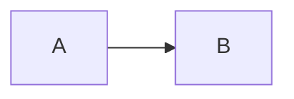
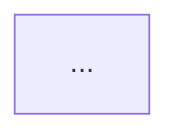

# Study Notes Writer

This skill defines writing style and structure for study notes optimized for multiple-choice exam preparation. The user is preparing for technical exams where slide wording = option wording.

## Before writing notes (REQUIRED)

Before producing any content, ask the user the following three questions ONE AT A TIME, then echo a `Config locked: { ... }` summary and wait for a final user nod before writing.

If a `<project>/.notes-config.json` file exists in the working directory, READ it first and skip questions whose values are already set. Print "Using cached config: { ... }" and confirm. If the user says "reconfigure" / "change config" / "重新配置", re-ask all three.

### Q1. Output format
- A. Obsidian MD only (callouts, `==highlight==`, no JS)
- B. Interactive HTML only (template.html-rendered, multi-color highlight tool, clickable quiz with localStorage progress, cheatsheet toggle)
- C. Both (write the MD, then also produce HTML)

### Q2. Course context (one shot, all fields)
- Course code + name (e.g., `IEOR 4510 - Project Management`)
- Class numbers in scope (e.g., `[1,2,3,4,5,6,8,9,10]` — gaps allowed)
- Exam format: MC / 大题 / 混合 / 无考试 (controls whether quizzes are generated; if 无考试 or 大题-only, omit `> [!question]` / ```quiz blocks)
- Native language for `<span style="color:gray">…</span>` supplementary text (quiz body stays English)

### Q3. Cheatsheet
- Generate per-class cheatsheet section + aggregated `cheatsheet.html`? (yes / no)
- If yes: page allowance for the printed cheatsheet (e.g., `4`; `0` = no limit)
- If no: skip per-class `<!-- cheatsheet:start/end -->` markers entirely; do not produce an aggregated file; suppress the cheatsheet toggle in mode-B dashboards

### After answers

Write the answers to `<project>/.notes-config.json` (overwrite if present), echo:

```
Config locked: {
  format: "B",
  course: "IEOR 4510 - Project Management",
  classes: [1,2,3,4,5,6,8,9,10],
  examFormat: "MC",
  nativeLang: "zh",
  cheatsheet: { enabled: true, pages: 4 }
}
```

Wait for user "go" / "ok" / "确认" before producing notes.

### Shortcut

If the user's first message implies an answer (e.g., "用 HTML 模式整理 class 3"), treat that as Q1=B and skip Q1; still ask Q2 and Q3 (unless cached).

## Why these rules exist

- User has weak baseline on the material; original notes felt "incoherent"
- Root causes identified: abstract language without decomposition, negative phrasing, single examples, skipped slide bullets, full Chinese translation losing exam-option anchors
- Exam is multiple-choice; **English slide wording often appears verbatim as exam options** — translation creates recognition friction
- User reads notes in Obsidian, which renders Mermaid + `==highlight==` + HTML spans natively

## Core writing principles

### 1. Pyramid structure
- Each section opens with the conclusion / core claim in one sentence
- Then expands with supporting evidence, examples, and nuance
- Use `⭐` at line start to mark exam-level key takeaways — readers should be able to scan a section in 5 seconds and find the takeaway

### 2. Positive phrasing only
- State what something IS, never "X is not Y"
- Negation is information-poor and can mislead
- ❌ "Map is not one-to-one"
- ✅ "Map can output 0, 1, or multiple KV pairs per input"

### 3. Decompose abstract terms; metaphors only as final recall anchor
- Use precise technical wording first
- Abstract terms like "heavy" / "limited" / "invisible" must be **immediately decomposed** into concrete meaning in the same paragraph — never leave them isolated
- Abstract quantities (like "0 KV pairs") must come with concrete executable scenarios — not just a single word label like "filter"
- Metaphors are **only acceptable** as a 1-line recall anchor at the END of a fully decomposed mechanism explanation (e.g., "Volumetric = 高速公路堵车 / Protocol = 骗子订座 / App = 点复杂菜" after explaining each mechanism step-by-step). Never use metaphor as the primary explanation.

### 4. Mechanism-level decomposition for protocols/algorithms/attacks
A one-line comparison table is just an **index** — for any protocol / algorithm / attack mechanism, expand into:
1. The normal flow (e.g., TCP 3-way handshake: step 1 SYN → step 2 SYN-ACK + allocate slot → step 3 ACK)
2. Where the attack/optimization intervenes (e.g., SYN flood = step 3 never sent → server's table fills up)
3. How the defense / counter-measure targets that exact step (e.g., SYN cookies = don't allocate at step 2, encode state into the SYN-ACK so client must echo it back)

Attack ↔ defense should be **paired**: explaining the attack mechanism without showing how the defense plugs into the same step is incomplete.

## Heading structure (REQUIRED, 2 levels)

Every class file uses exactly two content levels of heading; do not nest deeper.

```markdown
# Class N: <Topic>                       ← H1, file scope, one per file

## 1. Knowledge Module 🔥🔥🔥           ← H2, big topic, MUST carry 🔥 rating
### 1.1 Sub-concept                     ← H3, specific concept, MUST carry ⭐ takeaway + ≥1 quiz
### 1.2 Sub-concept

## 2. Knowledge Module 🔥🔥
### 2.1 Sub-concept
```

Rules:
- File starts with one `#` line: `# Class N: <Topic>`
- Every **content** `##` carries a 🔥 rating (mandatory) and is a knowledge module
- Every **content** `###` carries 1 ⭐ takeaway, ≥1 quiz (when exam format includes MC/混合), ≥1 slide quote when slide bullet exists
- Do NOT use `####` or deeper. If a sub-concept needs further nesting, flatten it inline or split it into a new `##`.
- **Meta-section exemptions:**
  - The cheatsheet section (`## 📋 Cheatsheet`) does NOT need 🔥 and contains its own structure — see "Cheatsheet rules"
  - Solutions-mode subsections (`### Question`, `### Approach`, `### Step-by-step`, `### Final answer`) do NOT need quizzes — see "Solutions mode"

## Visual formatting (cross-mode)

| MD source                     | Mode A render (Obsidian)            | Mode B render (HTML/marked)            | Use case                                       |
|-------------------------------|-------------------------------------|----------------------------------------|------------------------------------------------|
| `⭐` at line start            | text + visual                       | text + visual                          | Exam-level core takeaway (1 per `###`, max 2) |
| `==term==`                    | yellow highlight (Obsidian native)  | `<mark>` (yellow via CSS)              | Must-remember terminology                      |
| `**bold**`                    | bold                                | bold                                   | In-paragraph emphasis                          |
| `<span style="color:gray">…</span>` | gray text                       | gray text (CSS)                        | Supplementary explanation, design rationale    |
| `> blockquote`                | block quote                         | `<blockquote>` styled                  | Slide original English (matches exam options)  |
| `> [!question]` callout       | callout (mode A only)               | not used                               | Quiz (mode A)                                  |
| ` ```quiz ` fence             | inert code block (mode A unused)    | rendered as quiz card                  | Quiz (mode B)                                  |
| ` ```mermaid ` fence          | rendered diagram                    | rendered via mermaid.js                | Diagrams                                       |
| `🔥/🔥🔥/🔥🔥🔥` after `##`  | text                                | text                                   | Section-level importance                       |
| `<!-- cheatsheet:start/end --> | invisible HTML comment              | data anchor for toggle + aggregator    | Mark cheatsheet section                        |

### Renderer pitfalls (CRITICAL — learned from failures)

These are renderer bugs that silently break the file. They look fine in source but render wrong. Learn them once, never re-introduce:

1. **NEVER put `=` inside `==term==`** — Obsidian's highlight parser breaks when the inner content contains `=`. The whole `==Project = a temporary endeavor==` will render with literal `==` markers visible (highlight applies but markers don't get stripped).
   - ❌ `==EV = % complete × BAC==`
   - ❌ `==PM = application of knowledge, skills...==`
   - ✅ `==EV== = % complete × BAC` (highlight only the term)
   - ✅ `PM is the ==application of knowledge, skills, tools, techniques== to ==meet project requirements==` (highlight phrase tokens, not equation)

2. **NEVER write `$$` literally** — Obsidian interprets `$$` as opening MathJax math mode. A single stray `$$` opens math mode and turns ALL following text (until next `$$`) into italic monospace math font. The cheatsheet, tables, everything below silently corrupts.
   - ❌ `Fast + Good = $$` (slang for "expensive")
   - ✅ `Fast + Good = 贵（High Cost）` or `Fast + Good = expensive`
   - Single `$` is also risky for inline math (`$...$`); avoid currency in MD or escape with `\$`.

3. **NEVER use mermaid `flowchart` to draw triangles** — flowchart auto-layout stacks nodes vertically. A 3-node `Q --- T --- B --- Q` cycle renders as a vertical line with curved arrows, not a triangle.
   - ❌ ` ```mermaid flowchart TB ... Q --- T --- B --- Q ``` `
   - ✅ ASCII art with `▲ / \ ─` characters inside a fenced code block (no language tag) for triangles, hierarchies, or any fixed-shape diagram
   - mermaid is fine for: linear flowcharts (LR/TB stages), sequence diagrams, gantt, timeline, classDiagram. Bad for: triangles, fixed geometric shapes, anything where layout matters more than connectivity.

4. **Single backtick around HTML-comment markers in tables breaks table parsing** — `\| \`<!-- foo -->\` \|` may render fine but inline `<!--` next to table pipes can confuse Obsidian's table parser. Put HTML comments on their own line outside tables.

5. **Avoid `*` standalone in text** — bare `*` (e.g. as a multiplication sign) can trigger italics. Use `×` (Unicode U+00D7) or `\*` for multiplication.

When in doubt, paste the rendered output back and visually verify. Don't ship without preview.

### Section importance rating (mandatory on every `##` section)

Append a 🔥 rating to every `##` section title to signal exam priority:

| Rating | Meaning | When to use |
|---|---|---|
| `🔥🔥🔥` | 必考 / 极高频考点 | Slide 反复强调；老师明确画重点；考过原题或近似题 |
| `🔥🔥` | 重点 / 高概率出题 | 概念是后续章节的基础；slide 用大段篇幅展开 |
| `🔥` | 了解 / 低概率出题 | 背景介绍、历史脉络、cherry-on-top 优化 |

Format: `## 5. SQL Injection：经典案例 🔥🔥🔥`

The user reads notes with limited time — importance ratings let them prioritize when triaging which sections to deep-read vs scan.

## Output mode rules

The `format` field of the config (Q1) selects the writing mode.

### Mode A — Obsidian MD output

- File extension: `.md`
- Quiz syntax: Obsidian callout
  ```
  > [!question] Quiz
  > Question stem in **English**.
  > A. ...
  > B. ...
  > C. ...
  > D. ...
  >
  > > [!success]- Answer
  > > **B**. Brief explanation in English.
  ```
- Highlight: `==term==`
- Gray text: `<span style="color:gray">…</span>`
- Mermaid: ` ```mermaid ` fenced block
- Slide quote: `> blockquote`
- Cheatsheet markers: `<!-- cheatsheet:start --> … <!-- cheatsheet:end -->` (still useful for downstream Obsidian queries; harmless if unused)
- Reader opens in Obsidian; no JS, no install

### Mode B — Interactive HTML output

- File extension: `.html`
- Output is a copy of `~/.claude/skills/study-notes-writer/template.html` with two placeholders filled:
  - `{{TITLE}}` — `Class N: <Topic> — <Course Code>`
  - `{{MD_CONTENT}}` — the markdown body (verbatim, no HTML escaping needed; sits inside `<script type="text/markdown" id="content">…</script>`)
- Quiz syntax: ```quiz fenced block (the Obsidian callout is NOT used in mode B)
  ```
  ​```quiz
  Q: Question stem in English.
  A: Option A
  B: Option B
  C: Option C
  D: Option D
  correct: A
  explain: One-paragraph explanation in English. Cover why correct is right and at least one distractor's specific misconception.
  ```
- Highlight: `==term==` (preprocessed to `<mark>` in template.html)
- Gray text: `<span style="color:gray">…</span>` (CSS-styled)
- Mermaid: ` ```mermaid ` fenced block (post-processed to `<div class="mermaid">` in template.html)
- Slide quote: `> blockquote`
- Cheatsheet markers: REQUIRED `<!-- cheatsheet:start --> … <!-- cheatsheet:end -->` so the dashboard toggle can hide non-cheatsheet content

### Mode C — Both

Produce both files (`class<N>.md` AND `class<N>.html`) following A and B rules respectively. The MD source for both should be the same content with mode-specific quiz syntax: write the MD with ```quiz fences, then for the `.md` output convert ```quiz fences into Obsidian callout format on the way out.

### File naming

- Per-class notes: `class<N>.<ext>`
- Solutions: `class<N>_solutions.<ext>`
- Aggregated cheatsheet: `cheatsheet.<ext>`

## Diagrams

- Use Mermaid (Obsidian renders natively, no plugin needed)
- Preferred types: `flowchart`, `sequenceDiagram`, `classDiagram`, `gantt`
- For alignment-sensitive layouts (memory hierarchy, architecture diagrams), ASCII art is acceptable

## Content coverage requirements

1. **Preserve English slide bullets verbatim** in `> quote` blocks — especially comparison lists, design goals, and definitions. These are exam-option anchors.
2. **Multiple examples for hard concepts**: at least 2-3 different-shaped examples in a comparison table. Single example (like word count for MapReduce) doesn't help readers generalize.
3. **Don't skip slide-level technical details** (e.g., "map outputs 0/1/multiple KV", "sort by key") — these are mechanism-level anchors that often become exam questions.
4. **Abstract quantities require concrete executable scenarios** — never explain "0 KV" with just one word like "filter"; show the actual code path.
5. **Key examples need complete runnable code, not pseudocode**. Reader should see how strings become KV pairs, what shuffle input/output looks like, etc. Hadoop streaming (stdin/stdout) is a good choice for MapReduce.
6. **Proactively add concepts the slides skip** if they are needed for conceptual completeness or directly asked by the user (e.g., range partitioning for distributed sort). Mark these "新加" so the user knows it's an extension beyond slide content.

## Self-quiz questions (mandatory at end of each knowledge point)

Format using Obsidian callout:

````markdown
> [!question] Quiz
> Question stem in **English** (matches exam format).
> A. ...
> B. ...
> C. ...
> D. ...
>
> > [!success]- Answer
> > **B**. Brief explanation in English. Distractor analysis if useful.
````

Rules:
- **Both question stem AND answer/explanation must be in English** — matches the exam format (English multiple-choice). No Chinese in the question or answer body.
- One quiz per `##` section minimum
- Distractors should be "plausibly wrong"—readers who pick wrong should learn from the explanation, not feel tricked

### Anti-bias rules for option writing (CRITICAL)

Self-graded quiz/exam generation has two systematic failure modes that destroy test validity:

1. **Position bias**: model defaults to placing correct answer at B (~80% of the time). For any quiz set ≥ 5 questions, **explicitly distribute correct answers across A/B/C/D roughly evenly** (~25% each). When writing a single quiz, randomize which letter holds the correct answer — don't default to B.

2. **Length bias**: correct option is written as a complete mechanism explanation while distractors are short and dismissive. Reader can guess answer by length without reading content.

Mitigations:
- **All options ≈ same length** (within ~30% of each other in word count)
- **Distractors must be articulate plausible-wrong reasoning**, not single-word dismissals. Each distractor should be a real misconception a student could hold (e.g., confusing two related concepts, applying right reasoning to wrong scenario, mis-citing a slide).
- **Don't pad the correct answer with mechanism details** — those belong in the explanation block (`> [!success]-`), not the option text. Option states the answer; explanation justifies it.
- For quiz sets (mock exam, problem set), **track answer distribution** as you write — if 5 in a row are landing on B, deliberately move the next correct answer to A/C/D.

**Self-check before finalizing any quiz set**: count correct answers by letter. If any letter is <15% or >35% of total, redistribute.

## Writing convention block (put at top of every notes file)

```
> 写作约定：⭐ = 考点级别的核心结论；==highlight== = 必背术语；<span style="color:gray">灰色字体 = 补充说明</span>；引用块 = slide 原文（英文，与考题措辞一致）；每节末尾 `> [!question]` 是思考题，答案折叠在 `> [!success]-` 中点击展开。
```

## Section template

````markdown
## 2.X Section Title 🔥🔥🔥

⭐ ==One-sentence core claim with key terms highlighted==.

**Intro** (only when introducing a concept the reader hasn't seen before):
- **关系**：how it relates to a previously-covered concept
- **动机**：what specific problem prior approaches couldn't solve
- **How**：one-sentence mechanism summary
- **对比**：1-row trade-off vs alternatives (if multiple solutions exist)

> **原文 (slide):**
> [Slide bullet preserved in English]

**Concept breakdown** (explanation, table, or definitions)

| Term | Concrete meaning |
|---|---|
| ... | ... |

<span style="color:gray">Background, design rationale, or nuance that's helpful but not core.</span>

**Concrete example or runnable code** (where applicable)

```python
# real runnable code, not pseudocode
```



> [!question] Quiz
> Question in English?
> A. ... B. ... C. ... D. ...
>
> > [!success]- Answer
> > **B**. Explanation in English.
````

## Section ordering within a topic

Recommended flow:
1. **Intro block** (mandatory for any new concept) — see structure below
2. **Core abstraction / interface** — definitions of key terms
3. **Mechanism** — how it works internally
4. **Worked examples** (multiple, comparing different shapes)
5. **Optimizations / variants** (combiner, partitioner, etc.)
6. **System concerns** (architecture, fault tolerance, scheduling)
7. **Concept relationship diagram** (Mermaid) at end of major topic
8. **Cheat sheet table** of all terms for last-minute review

### Intro block structure (for any newly introduced concept)

When a section introduces a concept the reader hasn't seen before, open with a short intro block that answers four questions in order — keep it compact (2–5 lines, not paragraphs):

1. **关系 / Where it sits** — relationship to previously-covered concepts (e.g., "Spark RDD 是对 MapReduce intermediate output 写磁盘的反向回应")
2. **动机 / Why introduce it** — what specific problem it solves that prior approaches couldn't (e.g., "MapReduce 每个 stage 都要落 disk → 迭代 ML 算法慢 100×")
3. **怎么做 / How** — one-sentence mechanism summary (the full mechanism comes later in §3)
4. **对比 / Compared to alternatives** — when other solutions exist for the same problem, give a 1-row comparison table or 1-line trade-off (e.g., "Spark vs Hadoop MR vs Flink: 内存 / 容错 / 流批")

Example:

````markdown
## X. Spark RDD 🔥🔥🔥

⭐ ==RDD = immutable + lazy + lineage 三性质==.

**Intro**:
- **关系**：是 lecture 7 §2 MapReduce 模型的"内存版"演进
- **动机**：MapReduce 每个 stage 落 disk → 迭代算法（PageRank、ML）需读写 N 次磁盘 → 100× 慢
- **How**：把数据保留在内存，failure 时通过 lineage 重算丢失 partition
- **对比**：Hadoop MR（容错=disk）、Flink（流优先）、Dask（Python ecosystem）

> **原文 (slide):**
> ...
````

The intro is **NOT** a replacement for §3 mechanism — it's a 30-second orientation so the reader knows why they should care before reading 200 lines of detail.

## Cheatsheet rules

Applies only when Q3.cheatsheet.enabled = true. If false, skip this entire section, do not include cheatsheet markers in any class file, and do not produce `cheatsheet.<ext>`.

### Per-class cheatsheet section (last `##` of every class file)

```markdown
<!-- cheatsheet:start -->
## 📋 Cheatsheet (Class N)
- ⭐ Key formula 1
- ⭐ Key formula 2
| Term | Meaning |
|---|---|
| ... | ... |

<!-- cheatsheet:end -->
```

Constraints:
- **No hard per-class line limit.** Length is driven by 🔥 ratings — write what's worth carrying into the exam, not what fills a quota.
- Priority: 🔥🔥🔥 → must include; 🔥🔥 → include if relevant to exam; 🔥 → exclude unless explicitly important.
- Allowed content: ⭐ takeaways, formulas, key term tables, Mermaid relation diagrams.
- Forbidden content: slide quotes (already in main notes), quizzes, prose explanations, examples, code listings.
- Print-friendly: monochrome readable (don't rely on color), avoid wide tables that overflow page width.

### Aggregated cheatsheet file

After all class notes are written, produce `cheatsheet.<ext>` whose content is the concatenation of every per-class cheatsheet section, in class order. In mode B, use the same `template.html` shell — highlight tool still works on the aggregate.

### Page-budget check (mode B only, when Q3.cheatsheet.pages > 0)

After producing `cheatsheet.html`, run a rough page estimate (~50 lines per printed page at default settings). If the estimate exceeds Q3.cheatsheet.pages, surface a "trim suggestions" list to the user, ordered low-priority-first (🔥 then 🔥🔥), and ask the user which sections to remove. **Never auto-trim** — the user decides.

## Solutions mode (for problem sets like Class 11)

Trigger: user asks for "solutions" / "answers" / "考题答案" / "exam reference" rather than "notes".

### Differences from notes mode

- **Suppress quiz generation** — the document IS quiz answers. No ```quiz fences, no `> [!question]` callouts.
- **Heading rule** — same 2-level rule, but each `##` is a problem (not a knowledge module), and `###` are the solving phases (Question / Approach / Step-by-step / Final answer). Meta-section exemption applies: solving-phase `###`s do not need quiz/⭐.
- **Cheatsheet section content** — becomes "solving patterns": which formula to apply for which problem type, common traps. Not term tables.
- **Highlight tool stays useful** — user marks "this step I always forget", "this trap caught me" in different colors.

### Per-problem template

```markdown
## Problem N

### Question
> [English problem statement preserved verbatim from the slide / exam paper]

### Approach
⭐ ==One-sentence solving strategy==.
- **Why this method:** what about the question makes this approach right
- **Common trap:** what students do wrong

### Step-by-step
1. Step 1 — including any formulas, with concrete numbers from the problem
2. Step 2 — show the calculation
3. Step 3 — final manipulation

### Final answer
⭐ ==Boxed final answer with units==.

> Sanity check: <one-line verification — does the answer's order of magnitude / sign / units make sense?>
```

### File naming

`class<N>_solutions.<ext>` (where `<N>` is the exam reference class number, e.g., `class11_solutions.html`).

## When NOT to use this skill

- User asks for a quick summary, not exam-level notes
- Content isn't for exam preparation (runbook, design doc, etc.)
- User explicitly asks for a different format
