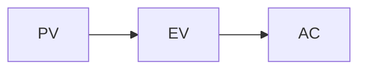

# study-notes-writer skill — interactive HTML refresh

## 1. Goal

Upgrade the `study-notes-writer` skill so it can produce **interactive, single-file HTML study notes** in addition to its current Obsidian-MD output. Designed for shareability: zero install for end users, one folder ships the whole skill.

The trigger driving this work: user is preparing for an upcoming exam (4 mixed quantitative/qualitative questions, 2-sheet/4-page cheatsheet allowed) and wants exam-prep features (clickable quiz with progress persistence, multi-color text highlighting, printable cheatsheet) that plain MD cannot offer.

## 2. Non-goals (out of scope for this iteration)

- Producing the actual class 1-10 notes / class 11 solutions / aggregated cheatsheet content. That happens in a follow-up phase **after** this skill update lands.
- Cross-device progress sync (would need a backend; deliberately rejected per user).
- Pre-bundled offline lib distribution (CDN is acceptable for v1; offline mode is a documented future option).
- Mobile-first responsive polishing (target = desktop browser).

## 3. End-user-visible behavior

### 3.1 Three configuration questions (asked at session start)

The skill asks the user **three** clarifying questions before producing any content. Ask one at a time.

**Q1. Output format**
- A. Obsidian MD only (callouts, `==highlight==`, no JS)
- B. Interactive HTML only (template-rendered, multi-color highlight tool, clickable quiz with localStorage progress, cheatsheet toggle)
- C. Both (write MD, then also produce HTML)

**Q2. Course context** (one shot, all fields)
- Course code + name (e.g., `IEOR 4510 - Project Management`)
- Class numbers in scope (e.g., `[1,2,3,4,5,6,8,9,10]`; gaps allowed)
- Exam format: MC / 大题 / 混合 / 无考试 (controls whether quizzes are generated)
- Native language for gray supplementary text (quiz body stays English)

**Q3. Cheatsheet**
- Generate cheatsheet section + aggregated `cheatsheet.html`? (yes / no)
- If yes: page allowance for the printed cheatsheet (e.g., `4`; `0` = no limit)
- If no: skip per-class cheatsheet section entirely, no aggregated file, no toggle in dashboard

After all three are answered, the skill outputs a `Config locked: { ... }` block and waits for a final user nod before writing.

### 3.2 Config caching

First run writes answers to `<project>/.notes-config.json` in the user's working directory. Subsequent skill invocations in the same project:
- Read `.notes-config.json` if present → skip Q1/Q2/Q3 → echo "Using cached config: ..."
- If user says "reconfigure" / "change config" → re-ask, overwrite the file.

### 3.3 Defaults (NOT asked, written into skill rules)

- Heading style: 2-level (`##` main / `###` sub) — see §4.1
- Quiz feedback: single-question submit, immediate reveal, retry allowed but first-attempt counts — see §4.4
- Highlight: 4 colors (yellow=必背 / pink=易错 / blue=老师强调 / green=已掌握) — see §4.3
- Lib loading: CDN (marked + mermaid). Inline mode is a future-work option, not v1.

## 4. Design details

### 4.1 Two-level heading rule (applies to both modes)

```markdown
# Class 3: Project Scheduling           ← H1 = class title (file scope)

## 1. PERT/CPM 🔥🔥🔥                   ← H2 = main module, fire rating goes here
### 1.1 Activity Network Diagram        ← H3 = sub-concept, ⭐/quiz/slide-quote here
### 1.2 Forward / Backward Pass
### 1.3 Critical Path Identification

## 2. Gantt Charts 🔥🔥
### 2.1 Construction
### 2.2 Resource Loading
```

Rules:
- File starts with one `#` line: `# Class N: <Topic>`
- Every **content** `##` carries a 🔥 rating (mandatory) and is a knowledge module
- Every **content** `###` carries 1 ⭐ takeaway, ≥1 quiz (if exam format = MC or 混合), ≥1 slide quote when slide bullet exists
- No `####` or deeper — flatten or split into a new `##` if a sub-concept needs further nesting
- **Meta-sections are exempt from these rules**: cheatsheet section (`## 📋 Cheatsheet`) does not need 🔥; solutions-mode subsections (`### Approach`, `### Step-by-step`, `### Final answer`) do not need quizzes — see §4.5 and §4.6

### 4.2 File outputs

| File | Mode A (MD) | Mode B (HTML) | Mode C (Both) |
|---|---|---|---|
| Per-class notes | `class<N>.md` | `class<N>.html` | both |
| Class 11 solutions | `class11_solutions.md` | `class11_solutions.html` | both |
| Aggregated cheatsheet | `cheatsheet.md` | `cheatsheet.html` | both |
| Config | `.notes-config.json` | same | same |

In mode B, all `.html` files share the same `template.html` shell from the skill folder. Only the `<script id="content">` block differs per file.

### 4.3 HTML template architecture (mode B / C)

`~/.claude/skills/study-notes-writer/template.html` (one file, copied per output):

```html
<!DOCTYPE html>
<html lang="en">
<head>
  <meta charset="UTF-8">
  <title>{{TITLE}}</title>
  <style>/* ~200 lines: highlight palette, quiz card, fire ratings, callouts, dashboard, print rules */</style>
</head>
<body>
  <header id="dashboard"><!-- populated by JS --></header>
  <main id="rendered"><!-- markdown rendered here --></main>
  <div id="hl-toolbar"><!-- floating highlight color picker --></div>

  <script type="text/markdown" id="content">
{{MD_CONTENT}}
  </script>

  <script src="https://cdn.jsdelivr.net/npm/marked@12/marked.min.js"></script>
  <script src="https://cdn.jsdelivr.net/npm/mermaid@10/dist/mermaid.min.js"></script>
  <script>
    /* ~250 lines, no framework:
       - render(): textContent of #content → marked.parse() with custom extensions
                   (quiz fence, cheatsheet comments) → into #rendered
       - mermaid.run() over rendered diagrams
       - initHighlight(): mouseup → floating color picker → wrap selection in <mark class="hl-{color}">,
                          persist {ranges} to localStorage; restore on load
       - initQuiz(): wire each .quiz-card's options + Submit + Show-Answer + Retry,
                     persist {selected, firstCorrect, attempts} to localStorage,
                     update dashboard counters
       - initCheatsheetToggle(): toggle .cheatsheet-only body class to hide non-cheatsheet sections
       - initDashboard(): aggregate quiz state, render top header
       - initExportButton(): dump highlights+quiz state as JSON for migration
    */
  </script>
</body>
</html>
```

Two placeholders Claude fills per file:
- `{{TITLE}}` — e.g., `"Class 3: Project Scheduling — IEOR 4510"`
- `{{MD_CONTENT}}` — the per-class markdown (verbatim, no HTML escape needed inside `<script type="text/markdown">`)

The `<script type="text/markdown">` trick keeps the MD un-parsed by HTML and lets JS read it via `.textContent`.

### 4.4 Quiz syntax (replaces Obsidian callout in mode B; mode A keeps callout)

In mode B/C MD source, quizzes are fenced blocks:

```text
​```quiz
Q: What does CPI > 1 indicate about a project?
A: Project is under budget
B: Project is over budget
C: Project is ahead of schedule
D: Project is behind schedule
correct: A
explain: CPI = EV / AC. CPI > 1 means earned value exceeds actual cost, i.e., the project has spent less than the value it has produced — under budget. SPI handles schedule (B/C/D distractors).
```

Custom marked extension turns the fence into a `<div class="quiz-card" data-quiz-id="...">` with structured children. ID is auto-assigned by index within file (`q1`, `q2`, ...).

Mode A keeps the existing Obsidian `> [!question] / > [!success]-` callout. Anti-bias rules (position + length) apply equally to both modes.

### 4.5 Cheatsheet system

**Per-class cheatsheet section** (mandatory, last `##` of every class file):

```markdown
<!-- cheatsheet:start -->
## 📋 Cheatsheet (Class 3)
- ⭐ EV = %complete × BAC, CPI = EV/AC, SPI = EV/PV
- ⭐ CPI<1 = over budget; SPI<1 = behind schedule
| Term | Definition |
|---|---|
| BAC | Budget at completion |
...

<!-- cheatsheet:end -->
```

Constraints (enforced in SKILL.md rules):
- **No hard per-class line limit.** Each class's cheatsheet length is driven by the 🔥 ratings of its modules — write what's worth carrying into the exam, not what fills a quota.
- Priority order for inclusion: 🔥🔥🔥 → must include; 🔥🔥 → include if relevant; 🔥 → exclude unless explicitly important.
- Content allowed: ⭐ takeaways, formulas, key term tables, Mermaid relation diagrams.
- Content forbidden: slide quotes (already in main notes), quizzes, prose explanations, examples.
- Print-friendly: monochrome readable (don't rely on color), avoid wide tables that overflow.
- **Aggregation-time page check** (only when user gave a page allowance via Q3): after generating `cheatsheet.html`, the skill runs a rough page estimate (e.g., assume ~50 lines/page at print default) and if the total exceeds the allowance, surfaces a "trim suggestion" listing low-priority sections (🔥-tier first) to the user — user decides what to drop. Never auto-trim.

**Cheatsheet-only toggle** (mode B): button in dashboard adds `body.cheatsheet-only` class → CSS hides everything outside `<!-- cheatsheet:start -->`..`<!-- cheatsheet:end -->` markers.

**Aggregated `cheatsheet.html`** (mode B/C): a separate HTML file produced after all class notes are done. Its `<script id="content">` block is the concatenation of all per-class cheatsheet sections, in class order. Uses the same `template.html` shell, so highlight tool still works on the aggregate page.

### 4.6 Class 11 (and similar problem-set content) mode

When the user asks for "solutions" / "answers" / "考题答案" rather than "notes":
- Suppress quiz generation (the document IS quiz answers)
- Use this section structure per problem:
  ```markdown
  ## Problem N 🔥 (omit fire rating if all problems equal weight)
  ### Question (slide quote)
  > [English problem statement preserved verbatim]

  ### Approach
  ⭐ ==One-sentence solving strategy==.
  - Why this method: ...
  - Common trap: ...

  ### Step-by-step
  1. ...
  2. ...

  ### Final answer
  ⭐ ==Boxed final answer==.
  ```
- Cheatsheet section becomes "solving patterns" (which formula → which problem type)
- Highlight tool stays useful (mark "this step I always forget")

### 4.7 Preserved rules from current skill (unchanged)

These quality rules stay verbatim in SKILL.md, applying to both modes:
- Pyramid structure (conclusion-first per section)
- Positive phrasing (no "X is not Y")
- Decompose abstract terms; metaphors only as final recall anchor
- Mechanism-level decomposition for protocols/algorithms/attacks (attack ↔ defense paired)
- Preserve English slide bullets verbatim in `> quote` blocks
- Multiple examples for hard concepts (≥ 2-3 different shapes)
- Don't skip slide-level technical details
- Runnable code, not pseudocode
- ⭐ for exam-level takeaways, max 2 per `###`
- 🔥/🔥🔥/🔥🔥🔥 fire rating on every `##`
- Quiz anti-bias: position bias mitigation (distribute correct answers A/B/C/D), length bias mitigation (options ≈ same length, distractors articulate)
- Quiz body in English (matches exam format)

### 4.8 Visual formatting cross-mode mapping

| MD source | Mode A render (Obsidian) | Mode B render (HTML/marked) |
|---|---|---|
| `==term==` | yellow highlight (Obsidian native) | `<mark>` styled yellow via CSS |
| `<span style="color:gray">…</span>` | gray text (Obsidian inline HTML) | gray text (CSS) |
| `> quote` | block quote | `<blockquote>` styled |
| `> [!question]` | callout (mode A only) | not used |
| ` ```quiz ` fence | inert code block (mode A doesn't use) | rendered as quiz card |
| ` ```mermaid ` fence | rendered diagram (Obsidian native) | rendered via mermaid.js |
| `🔥🔥🔥` after `##` | text (visible) | text (visible) + CSS class for module styling |
| `<!-- cheatsheet:start -->` | invisible HTML comment | data anchor for toggle + aggregator |

## 5. Skill folder layout (after this update)

```
~/.claude/skills/study-notes-writer/
├── SKILL.md            # writing rules + Q1/Q2 protocol + mode A/B branches
├── template.html       # mode B HTML shell (CSS + JS + placeholders)
├── design.md           # this file
└── examples/           # optional: 1 minimal demo per mode
    ├── class_demo.md   # mode A example
    └── class_demo.html # mode B example
```

`SKILL.md` structure (after update):
```
---
name: study-notes-writer
description: ...
---

# Study Notes Writer

## Why these rules exist
[unchanged]

## Before writing notes (REQUIRED)
[Q1 + Q2 protocol; cache to .notes-config.json]

## Writing principles (apply to all modes)
[pyramid / positive phrasing / decompose / mechanism / anti-bias — unchanged]

## Heading rule (NEW: 2-level)
[# class title / ## main module + 🔥 / ### sub-concept + ⭐ + quiz]

## Mode A — Obsidian MD output
[current rules: callout quiz, Obsidian highlight, ==term==, etc.]

## Mode B — Interactive HTML output
[template.html usage, ```quiz fence syntax, cheatsheet markers, file naming]

## Cheatsheet rules (apply to both modes)
[per-class section structure, length budget, forbidden content, aggregation]

## Solutions mode (for problem-set content like Class 11)
[suppress quiz, problem template, solving-patterns cheatsheet]

## When NOT to use this skill
[unchanged]
```

## 6. Open questions for user review

None blocking. Following items deliberately deferred:
- Whether to also offer an "inline lib" build for fully offline use (defer to v2; CDN works for v1)
- Whether dashboard should show per-`##`-section progress bar (current design = single class-level counter; extension obvious if needed)
- Whether to support cross-class navigation (e.g., index page linking class1.html..class10.html); skipped for v1, user can just open files directly

## 7. Acceptance criteria

The skill update is done when:
1. `template.html` exists and renders a sample MD with: heading hierarchy, slide quotes, mermaid, ```quiz fence as interactive card, ==highlight== as `<mark>`, gray spans, fire ratings, cheatsheet toggle button, dashboard counters
2. localStorage round-trips highlight + quiz state across page reloads
3. SKILL.md has Q1/Q2 protocol at top, mode A and mode B branches, two-level heading rule, cheatsheet rules, solutions mode rules
4. `.notes-config.json` is read/written correctly across sessions
5. Quiz `correct` letter distribution is enforced (anti-bias rule applied to mode B's ```quiz fence too)
6. A demo class (any class from user's PM course, simplest one) renders cleanly in mode B end-to-end

## 8. Implementation phases (sketch — full plan via writing-plans skill)

1. Write `template.html` (HTML/CSS/JS, no framework)
2. Update `SKILL.md` with Q1/Q2 protocol, mode branches, new rules
3. Smoke-test: have Claude produce a 1-section demo class file, open in browser, verify all interactive features
4. (Follow-on, separate cycle) Use updated skill to produce class 1-10 notes + class 11 solutions + aggregated cheatsheet
