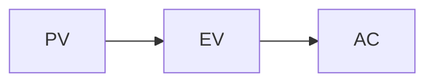

# Class Demo: PM Skill Smoke Test

> 写作约定：⭐ = 考点级别的核心结论；==highlight== = 必背术语；灰色字体 = 补充说明；引用块 = slide 原文（英文，与考题措辞一致）；每节末尾 `> [!question]` 是思考题，答案折叠在 `> [!success]-` 中点击展开。

## 1. Earned Value Management 🔥🔥🔥

### 1.1 Core formulas

⭐ ==EV = % complete × BAC; CPI = EV / AC; SPI = EV / PV==.

> **原文 (slide):**
> CPI > 1 indicates the project is under budget.

EV is the budgeted cost of work performed; AC is what was actually paid; PV is what should have been spent by now.

> [!question] Quiz
> What does CPI > 1 indicate about a project?
> A. Project is under budget
> B. Project is over budget
> C. Project is ahead of schedule
> D. Project is behind schedule
>
> > [!success]- Answer
> > **A**. CPI = EV / AC. CPI > 1 means earned value exceeds actual cost — under budget. SPI handles schedule (B/C/D distractors).

## 2. Risk Management 🔥🔥

### 2.1 Identification

⭐ ==Risk register== is the canonical artifact.

> [!question] Quiz
> Which document tracks identified risks throughout a project?
> A. Charter
> B. Risk register
> C. WBS
> D. Stakeholder map
>
> > [!success]- Answer
> > **B**. The risk register lists each identified risk with probability, impact, and response.

<!-- cheatsheet:start -->
## 📋 Cheatsheet (Demo)
- ⭐ EV / CPI / SPI formulas
- ⭐ CPI<1 = over budget; SPI<1 = behind schedule
- Risk register = primary risk-tracking artifact

| Term | Meaning |
|---|---|
| BAC | Budget at completion |
| EAC | Estimate at completion |
<!-- cheatsheet:end -->
