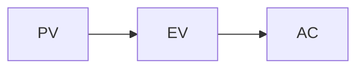
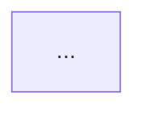

# study-notes-writer skill — interactive HTML refresh — Implementation Plan

> **For agentic workers:** REQUIRED SUB-SKILL: Use superpowers:subagent-driven-development (recommended) or superpowers:executing-plans to implement this plan task-by-task. Steps use checkbox (`- [ ]`) syntax for tracking.

**Goal:** Upgrade `~/.claude/skills/study-notes-writer/` so it can produce single-file interactive HTML study notes (multi-color highlight, clickable quiz with localStorage progress, cheatsheet toggle), in addition to its existing Obsidian MD output. End users get zero install — open the HTML in any browser.

**Architecture:** Add a self-contained `template.html` (HTML + embedded CSS + vanilla JS, with marked.js + mermaid via CDN). The skill's writing role gains a Q1/Q2/Q3 protocol at the top of `SKILL.md` plus mode-A (MD) / mode-B (HTML) branches. For mode B, Claude copies `template.html`, fills two placeholders (`{{TITLE}}` + `{{MD_CONTENT}}`), writes `class<N>.html`. No build step. No backend.

**Tech Stack:** vanilla HTML/CSS/JS, marked.js v12 (CDN), mermaid.js v10 (CDN), localStorage. Test fixture rendered + verified manually in browser; final smoke test optional via Playwright (document-skills:webapp-testing).

**Spec reference:** `~/.claude/skills/study-notes-writer/design.md`

---

## File structure (final state)

```
~/.claude/skills/study-notes-writer/
├── SKILL.md            # Modified: Q1/Q2/Q3 protocol + mode A/B sections + new rules
├── template.html       # NEW: HTML shell (~250 lines CSS, ~250 lines JS)
├── design.md           # Already written
├── plan.md             # This file
└── examples/           # NEW
    ├── class_demo.md   # Mode A demo
    └── class_demo.html # Mode B demo (template.html with demo content embedded)
```

## Pre-flight notes for the implementer

- `~/.claude/skills/` is normally not git-versioned. If you want commit history for this work, run `git init` once in `~/.claude/skills/study-notes-writer/` before starting. Otherwise skip the `git commit` step in each task; the file save itself is the checkpoint.
- All "verification" steps are run by opening `examples/class_demo.html` in a browser (double-click on macOS) and confirming the described behavior. Use Chrome or Firefox; Safari has stricter `file://` localStorage rules.
- The implementer will use a fixed test fixture (defined in Task 1) embedded in `examples/class_demo.html` to verify each feature incrementally.

## Test fixture (used across all template.html tasks)

This MD content goes inside `<script type="text/markdown" id="content">` of `examples/class_demo.html`. It exercises every feature: H1/H2/H3, fire ratings, ⭐, slide quote, Mermaid, ```quiz fence, ==highlight==, gray span, cheatsheet markers.

```markdown
# Class Demo: PM Skill Smoke Test

## 1. Earned Value Management 🔥🔥🔥

### 1.1 Core formulas

⭐ ==EV = % complete × BAC; CPI = EV / AC; SPI = EV / PV==.

> **原文 (slide):**
> CPI > 1 indicates the project is under budget.

<span style="color:gray">EV is the budgeted cost of work performed; AC is what was actually paid; PV is what should have been spent by now.</span>



```quiz
Q: What does CPI > 1 indicate about a project?
A: Project is under budget
B: Project is over budget
C: Project is ahead of schedule
D: Project is behind schedule
correct: A
explain: CPI = EV / AC. CPI > 1 means earned value exceeds actual cost — under budget. SPI handles schedule (B/C/D distractors).
```

## 2. Risk Management 🔥🔥

### 2.1 Identification

⭐ ==Risk register== is the canonical artifact.

```quiz
Q: Which document tracks identified risks throughout a project?
A: Charter
B: Risk register
C: WBS
D: Stakeholder map
correct: B
explain: The risk register lists each identified risk with probability, impact, and response.
```

<!-- cheatsheet:start -->
## 📋 Cheatsheet (Demo)
- ⭐ EV / CPI / SPI formulas
- ⭐ CPI<1 = over budget; SPI<1 = behind schedule
- Risk register = primary risk-tracking artifact

| Term | Meaning |
|---|---|
| BAC | Budget at completion |
| EAC | Estimate at completion |
<!-- cheatsheet:end -->
```

---

## Task 1: Create template.html skeleton + demo fixture

**Files:**
- Create: `~/.claude/skills/study-notes-writer/template.html`
- Create: `~/.claude/skills/study-notes-writer/examples/class_demo.html`

This task gets the skeleton on disk so subsequent tasks can verify in browser. No interactive features yet.

- [ ] **Step 1.1: Create the skeleton template.html**

```html
<!DOCTYPE html>
<html lang="en">
<head>
  <meta charset="UTF-8">
  <title>{{TITLE}}</title>
  <style>
    /* CSS added in Tasks 2 + 9 + 10 */
    body { font-family: -apple-system, BlinkMacSystemFont, "Segoe UI", sans-serif; max-width: 860px; margin: 2em auto; padding: 0 1em; line-height: 1.6; color: #222; }
  </style>
</head>
<body>
  <header id="dashboard"></header>
  <main id="rendered"></main>
  <div id="hl-toolbar" hidden></div>

  <script type="text/markdown" id="content">
{{MD_CONTENT}}
  </script>

  <script src="https://cdn.jsdelivr.net/npm/marked@12/marked.min.js"></script>
  <script src="https://cdn.jsdelivr.net/npm/mermaid@10/dist/mermaid.min.js"></script>
  <script>
    // JS added in Tasks 3-11
    document.getElementById('rendered').textContent = 'Skeleton loaded. JS not yet wired.';
  </script>
</body>
</html>
```

- [ ] **Step 1.2: Create examples/class_demo.html**

Copy `template.html` to `examples/class_demo.html`. Replace `{{TITLE}}` with `Class Demo: PM Skill Smoke Test`. Replace the entire `<script type="text/markdown" id="content">...</script>` block with the test fixture defined at the top of this plan (the markdown starting with `# Class Demo: PM Skill Smoke Test` through `<!-- cheatsheet:end -->`).

- [ ] **Step 1.3: Verify in browser**

Double-click `examples/class_demo.html`. Expected: page shows `Skeleton loaded. JS not yet wired.` (the placeholder text from Step 1.1's bottom script). No errors in DevTools console (`Cmd+Opt+I`). The CDN scripts load without 404s.

- [ ] **Step 1.4: Commit (skip if not git-versioned)**

```bash
cd ~/.claude/skills/study-notes-writer
git add template.html examples/class_demo.html
git commit -m "feat(notes-skill): scaffold template.html + demo fixture"
```

---

## Task 2: Add base CSS (typography, callouts, fire/⭐, highlight palette, dashboard layout)

**Files:**
- Modify: `~/.claude/skills/study-notes-writer/template.html` (replace `<style>` block)

- [ ] **Step 2.1: Replace the `<style>` block with full base CSS**

Find the `<style>` block in `template.html` and replace its entire contents with:

```css
:root {
  --hl-yellow: #fff59d;
  --hl-pink: #f8bbd0;
  --hl-blue: #b3e5fc;
  --hl-green: #c8e6c9;
}
* { box-sizing: border-box; }
body { font-family: -apple-system, BlinkMacSystemFont, "Segoe UI", "PingFang SC", sans-serif; max-width: 860px; margin: 0 auto; padding: 4em 1em 4em; line-height: 1.65; color: #222; }
h1 { border-bottom: 2px solid #333; padding-bottom: 0.3em; margin-top: 0; }
h2 { color: #b91c1c; margin-top: 2.2em; border-bottom: 1px dashed #ddd; padding-bottom: 0.2em; }
h3 { color: #1e3a8a; margin-top: 1.6em; }
blockquote { border-left: 4px solid #888; padding: 0.5em 1em; background: #f8f8f8; color: #333; margin: 1em 0; }
table { border-collapse: collapse; margin: 1em 0; }
th, td { border: 1px solid #ccc; padding: 0.4em 0.8em; text-align: left; }
th { background: #f1f5f9; }
code { background: #f1f1f1; padding: 0.1em 0.3em; border-radius: 3px; font-size: 0.9em; }
pre { background: #f6f8fa; padding: 1em; border-radius: 6px; overflow-x: auto; }
pre code { background: transparent; padding: 0; }

/* Highlight palette */
mark { padding: 0 0.15em; border-radius: 2px; cursor: pointer; }
mark.hl-yellow { background: var(--hl-yellow); }
mark.hl-pink { background: var(--hl-pink); }
mark.hl-blue { background: var(--hl-blue); }
mark.hl-green { background: var(--hl-green); }
mark:not([class]) { background: var(--hl-yellow); }  /* default for ==term== */

/* Dashboard */
#dashboard { position: fixed; top: 0; left: 0; right: 0; background: #fffbe6; border-bottom: 2px solid #f0c244; padding: 0.6em 1em; display: flex; gap: 0.8em; align-items: center; flex-wrap: wrap; z-index: 10; font-size: 0.92em; }
#dashboard strong { font-size: 1em; }
#dashboard .stat { padding: 0.15em 0.6em; background: white; border-radius: 4px; border: 1px solid #ddd; }
#dashboard button { padding: 0.25em 0.7em; cursor: pointer; border: 1px solid #888; background: white; border-radius: 3px; font-size: 0.92em; }
#dashboard button:hover { background: #fff; border-color: #444; }

/* Highlight toolbar (floating) */
#hl-toolbar { position: absolute; background: white; border: 1px solid #aaa; border-radius: 4px; box-shadow: 0 2px 8px rgba(0,0,0,0.18); padding: 0.3em; display: flex; gap: 0.3em; z-index: 100; }
#hl-toolbar button { width: 1.6em; height: 1.6em; border: 1px solid #888; border-radius: 3px; cursor: pointer; padding: 0; }
#hl-toolbar .swatch-yellow { background: var(--hl-yellow); }
#hl-toolbar .swatch-pink { background: var(--hl-pink); }
#hl-toolbar .swatch-blue { background: var(--hl-blue); }
#hl-toolbar .swatch-green { background: var(--hl-green); }

/* Quiz card */
.quiz-card { border: 1px solid #ccc; border-radius: 8px; padding: 1em 1.2em; margin: 1.4em 0; background: #fafafa; }
.quiz-card .q { font-weight: 600; margin-bottom: 0.7em; }
.quiz-card .options { display: flex; flex-direction: column; gap: 0.45em; }
.quiz-card .opt { display: flex; align-items: flex-start; gap: 0.6em; padding: 0.5em 0.8em; border: 1px solid #ddd; border-radius: 5px; cursor: pointer; background: white; line-height: 1.45; }
.quiz-card .opt input { margin-top: 0.25em; }
.quiz-card .opt:hover { background: #f0f7ff; }
.quiz-card .opt.selected { border-color: #4f46e5; background: #eef2ff; }
.quiz-card.answered .opt { cursor: default; }
.quiz-card.answered .opt:hover { background: white; }
.quiz-card.answered .opt.selected:hover { background: #eef2ff; }
.quiz-card.answered .opt.correct { background: #dcfce7; border-color: #16a34a; }
.quiz-card.answered .opt.wrong { background: #fee2e2; border-color: #dc2626; }
.quiz-card .actions { margin-top: 0.9em; display: flex; gap: 0.5em; }
.quiz-card .actions button { padding: 0.3em 0.9em; cursor: pointer; border: 1px solid #888; background: white; border-radius: 4px; }
.quiz-card .explain { display: none; margin-top: 0.9em; padding: 0.65em 0.9em; background: #ecfdf5; border-left: 3px solid #16a34a; font-size: 0.95em; line-height: 1.55; }
.quiz-card.answered .explain { display: block; }

/* Cheatsheet section */
.cheatsheet { background: #fffbe6; border: 1px dashed #f0c244; padding: 1em 1.2em; border-radius: 8px; margin: 1.5em 0; }
body.cheatsheet-only main > :not(.cheatsheet) { display: none; }

/* Mermaid */
.mermaid { background: white; padding: 0.5em; border-radius: 6px; }

/* Print rules */
@media print {
  body { padding: 0.5em; max-width: none; font-size: 9pt; line-height: 1.4; }
  #dashboard, #hl-toolbar { display: none; }
  .quiz-card { display: none; }
  mark { background: transparent !important; border-bottom: 1px solid #888; }
  h1, h2, h3 { page-break-after: avoid; }
  pre, blockquote { page-break-inside: avoid; }
}
```

- [ ] **Step 2.2: Sync the same `<style>` block into examples/class_demo.html**

Replace the `<style>` block in `examples/class_demo.html` with the same content from Step 2.1.

- [ ] **Step 2.3: Verify in browser**

Reload `examples/class_demo.html`. Expected: still shows "Skeleton loaded. JS not yet wired." but with the page now using padding/typography from the new CSS (visibly the body has top padding for the future fixed dashboard, and the content text is wider/cleaner).

- [ ] **Step 2.4: Commit**

```bash
git add template.html examples/class_demo.html
git commit -m "feat(notes-skill): add base CSS for typography + callouts + dashboard"
```

---

## Task 3: Add markdown rendering pipeline

**Files:**
- Modify: `~/.claude/skills/study-notes-writer/template.html` (replace bottom `<script>` content)

- [ ] **Step 3.1: Replace the bottom `<script>` body with rendering bootstrap**

Find the `<script>` block at the end of `<body>` (the one without `src=`) and replace its body with:

```javascript
const NS = `pm-notes:${location.pathname}`;
const store = {
  get(key) { try { return JSON.parse(localStorage.getItem(`${NS}:${key}`)); } catch { return null; } },
  set(key, val) { localStorage.setItem(`${NS}:${key}`, JSON.stringify(val)); },
  clear() { Object.keys(localStorage).filter(k => k.startsWith(NS)).forEach(k => localStorage.removeItem(k)); }
};

function escapeHtml(s) { return s.replace(/&/g, '&amp;').replace(/</g, '&lt;').replace(/>/g, '&gt;'); }

function wrapCheatsheet(html) {
  return html.replace(/<!--\s*cheatsheet:start\s*-->([\s\S]*?)<!--\s*cheatsheet:end\s*-->/g,
    '<section class="cheatsheet">$1</section>');
}

// Pre-process MD: convert ==term== to <mark>...</mark> (marked doesn't handle this natively)
function preprocessMd(md) {
  return md.replace(/==([^=\n]+)==/g, '<mark>$1</mark>');
}

function renderAll() {
  let md = document.getElementById('content').textContent;
  md = preprocessMd(md);
  let html = marked.parse(md);
  html = wrapCheatsheet(html);
  document.getElementById('rendered').innerHTML = html;
}

renderAll();
```

- [ ] **Step 3.2: Sync into examples/class_demo.html**

Mirror the same script body change into `examples/class_demo.html`.

- [ ] **Step 3.3: Verify in browser**

Reload `examples/class_demo.html`. Expected:
- All headings (H1, H2, H3) render with the styled colors from Task 2
- The blockquote (slide quote) shows with grey background
- The ` ```mermaid ` block shows as a `<pre><code>` block (NOT yet rendered as a diagram — that's Task 4)
- The ` ```quiz ` block shows as a raw `<pre><code>` block (NOT yet rendered as a card — that's Task 5)
- `==EV = % complete × BAC; ...==` text appears with yellow highlight (the default `mark` styling)
- The `<span style="color:gray">...</span>` paragraph appears in gray
- Cheatsheet section appears with yellow dashed border

Open DevTools → Console: no errors.

- [ ] **Step 3.4: Commit**

```bash
git add template.html examples/class_demo.html
git commit -m "feat(notes-skill): wire marked.js rendering + ==highlight== preproc + cheatsheet wrapper"
```

---

## Task 4: Render Mermaid diagrams

**Files:**
- Modify: `~/.claude/skills/study-notes-writer/template.html`

Marked v12 outputs ` ```mermaid ` fences as `<pre><code class="language-mermaid">...</code></pre>`. Mermaid v10's `mermaid.run()` looks for `.mermaid` class. We post-process the rendered DOM.

- [ ] **Step 4.1: Add Mermaid post-process after `renderAll()`**

Insert this code in the inline `<script>` block, immediately AFTER the line `renderAll();`:

```javascript
function initMermaid() {
  document.querySelectorAll('pre code.language-mermaid').forEach(code => {
    const div = document.createElement('div');
    div.className = 'mermaid';
    div.textContent = code.textContent;
    code.parentElement.replaceWith(div);
  });
  if (window.mermaid) {
    mermaid.initialize({ startOnLoad: false, theme: 'default' });
    mermaid.run();
  }
}
initMermaid();
```

- [ ] **Step 4.2: Sync into examples/class_demo.html**

- [ ] **Step 4.3: Verify in browser**

Reload `examples/class_demo.html`. Expected:
- The ` ```mermaid ` block in §1.1 renders as a left-to-right flowchart: `PV → EV → AC` (three boxes connected by arrows)
- No console errors

- [ ] **Step 4.4: Commit**

```bash
git add template.html examples/class_demo.html
git commit -m "feat(notes-skill): post-process mermaid fences via mermaid.js"
```

---

## Task 5: Custom marked extension for ```quiz fenced blocks

**Files:**
- Modify: `~/.claude/skills/study-notes-writer/template.html`

- [ ] **Step 5.1: Insert the quiz extension BEFORE `renderAll()` is called**

Find the line `renderAll();` in the inline script. Insert this BEFORE it (and before `function renderAll() { ... }` definition is fine too, as long as `marked.use(...)` runs before `marked.parse(...)`):

```javascript
let quizCounter = 0;

const quizExt = {
  name: 'quiz',
  level: 'block',
  start(src) { return src.indexOf('\n```quiz') + 1 || src.indexOf('```quiz'); },
  tokenizer(src) {
    const match = src.match(/^```quiz\n([\s\S]*?)\n```/);
    if (!match) return undefined;
    const body = match[1];
    const data = { Q: '', A: '', B: '', C: '', D: '', correct: '', explain: '' };
    let lastKey = null;
    for (const line of body.split('\n')) {
      const m = line.match(/^(Q|A|B|C|D|correct|explain):\s*(.*)$/);
      if (m) { data[m[1]] = m[2]; lastKey = m[1]; }
      else if (lastKey) { data[lastKey] += '\n' + line; }
    }
    return { type: 'quiz', raw: match[0], ...data };
  },
  renderer(t) {
    quizCounter++;
    const id = `quiz-${quizCounter}`;
    const correct = t.correct.trim();
    const opts = ['A','B','C','D'].map(L =>
      `<label class="opt" data-letter="${L}"><input type="radio" name="${id}" value="${L}"><span><b>${L}.</b> ${escapeHtml(t[L].trim())}</span></label>`
    ).join('');
    return `<div class="quiz-card" data-id="${id}" data-correct="${correct}">
      <div class="q">${escapeHtml(t.Q.trim())}</div>
      <div class="options">${opts}</div>
      <div class="actions">
        <button class="submit">Submit</button>
        <button class="show-answer">Show Answer</button>
        <button class="retry" hidden>Retry</button>
      </div>
      <div class="explain"><b>Answer: ${correct}.</b> ${escapeHtml(t.explain.trim())}</div>
    </div>`;
  }
};

marked.use({ extensions: [quizExt] });
```

- [ ] **Step 5.2: Sync into examples/class_demo.html**

- [ ] **Step 5.3: Verify in browser**

Reload `examples/class_demo.html`. Expected:
- The two ` ```quiz ` blocks now render as styled quiz cards (white background, rounded border, 4 options each, three buttons: Submit / Show Answer / Retry)
- Clicking an option toggles a radio button but does nothing else yet (Task 6)
- The "explain" block is hidden (`display: none`)

- [ ] **Step 5.4: Commit**

```bash
git add template.html examples/class_demo.html
git commit -m "feat(notes-skill): custom marked extension renders quiz fenced blocks as cards"
```

---

## Task 6: Quiz interaction + localStorage persistence

**Files:**
- Modify: `~/.claude/skills/study-notes-writer/template.html`

- [ ] **Step 6.1: Append quiz wiring to the inline script (after `initMermaid()`)**

After the `initMermaid();` call, add:

```javascript
function markAnswered(card, selected, correct) {
  card.classList.add('answered');
  card.querySelectorAll('.opt').forEach(o => {
    const v = o.querySelector('input').value;
    o.classList.remove('correct', 'wrong');
    if (v === correct) o.classList.add('correct');
    if (v === selected && v !== correct) o.classList.add('wrong');
  });
  card.querySelector('.retry').hidden = false;
  card.querySelectorAll('input').forEach(i => i.disabled = true);
}

function initQuiz() {
  const state = store.get('quiz') || {};
  document.querySelectorAll('.quiz-card').forEach(card => {
    const id = card.dataset.id;
    const correct = card.dataset.correct;
    const cardState = state[id] || { selected: null, firstCorrect: null, attempts: 0 };

    // Restore: only first-attempt result is persistent. Body answered-state is reapplied.
    if (cardState.firstCorrect !== null && cardState.selected) {
      const input = card.querySelector(`input[value="${cardState.selected}"]`);
      if (input) input.checked = true;
      markAnswered(card, cardState.selected, correct);
    }

    card.querySelectorAll('input').forEach(i => i.addEventListener('change', () => {
      card.querySelectorAll('.opt').forEach(o => o.classList.remove('selected'));
      i.closest('.opt').classList.add('selected');
    }));

    card.querySelector('.submit').addEventListener('click', () => {
      const sel = card.querySelector('input:checked');
      if (!sel) { alert('Please pick an answer first.'); return; }
      const v = sel.value;
      const isCorrect = (v === correct);
      cardState.selected = v;
      cardState.attempts++;
      if (cardState.firstCorrect === null) cardState.firstCorrect = isCorrect;
      state[id] = cardState;
      store.set('quiz', state);
      markAnswered(card, v, correct);
      updateDashboard();
    });

    card.querySelector('.show-answer').addEventListener('click', () => {
      if (cardState.firstCorrect === null) {
        cardState.firstCorrect = false;
        cardState.attempts = Math.max(cardState.attempts, 1);
      }
      cardState.selected = cardState.selected || correct;
      state[id] = cardState;
      store.set('quiz', state);
      markAnswered(card, cardState.selected, correct);
      updateDashboard();
    });

    card.querySelector('.retry').addEventListener('click', () => {
      card.classList.remove('answered');
      card.querySelectorAll('input').forEach(i => { i.checked = false; i.disabled = false; });
      card.querySelectorAll('.opt').forEach(o => o.classList.remove('selected', 'correct', 'wrong'));
      card.querySelector('.retry').hidden = true;
    });
  });
}
initQuiz();

function updateDashboard() { /* placeholder, real impl in Task 8 */ }
```

- [ ] **Step 6.2: Sync into examples/class_demo.html**

- [ ] **Step 6.3: Verify in browser**

Reload `examples/class_demo.html`. Test sequence:
1. Pick option **A** in the first quiz, click **Submit**. Expected: option A turns green (correct), Retry button appears, options become disabled, explain block becomes visible.
2. Pick option **B** in the second quiz, click **Submit**. Expected: B turns red (wrong), the actual correct (B per fixture is correct — pick C instead to test wrong path; correct should turn green, C should turn red).
3. Reload the page. Expected: both quizzes are STILL marked answered with the same colors and selected option.
4. Click **Retry** on first quiz. Expected: state clears in DOM (options re-enabled, no colors). Reload page → answered state is restored from localStorage (because firstAttempt is still recorded).
5. Open DevTools → Application → Local Storage → `file://` host. Confirm key `pm-notes:<path>:quiz` exists with the saved state.

- [ ] **Step 6.4: Commit**

```bash
git add template.html examples/class_demo.html
git commit -m "feat(notes-skill): quiz click-submit-reveal-retry with localStorage persistence"
```

---

## Task 7: Multi-color highlight tool with localStorage persistence

**Files:**
- Modify: `~/.claude/skills/study-notes-writer/template.html`

Strategy: save the rendered `<main id="rendered">` innerHTML after each highlight change. Restore on reload. Content-hash the source MD to invalidate stale highlights when content changes.

- [ ] **Step 7.1: Add a content-hash helper near the top of the inline script**

Just after the `store` definition, add:

```javascript
function hashStr(s) {
  let h = 0;
  for (let i = 0; i < s.length; i++) { h = ((h << 5) - h + s.charCodeAt(i)) | 0; }
  return h.toString(36);
}
```

- [ ] **Step 7.2: After `renderAll()` runs, before `initMermaid()`, attempt to restore highlights**

Insert this between `renderAll();` and `initMermaid();`:

```javascript
const sourceHash = hashStr(document.getElementById('content').textContent);
const savedHl = store.get('highlights');
if (savedHl && savedHl.hash === sourceHash) {
  document.getElementById('rendered').innerHTML = savedHl.html;
}
```

This restores highlight-augmented HTML if the source MD hasn't changed since last save.

- [ ] **Step 7.3: Append the highlight tool wiring after `initQuiz()`**

```javascript
function saveHighlights() {
  store.set('highlights', {
    hash: sourceHash,
    html: document.getElementById('rendered').innerHTML,
  });
  updateDashboard();
}

function initHighlight() {
  const colors = ['yellow', 'pink', 'blue', 'green'];
  const toolbar = document.getElementById('hl-toolbar');
  toolbar.innerHTML = colors.map(c =>
    `<button class="swatch-${c}" data-c="${c}" title="Highlight ${c}"></button>`
  ).join('') + '<button data-c="remove" title="Remove highlight" style="font-weight:bold;">✕</button>';

  function showToolbar(rect) {
    toolbar.style.left = `${window.scrollX + rect.left + rect.width / 2 - 80}px`;
    toolbar.style.top = `${window.scrollY + rect.top - 38}px`;
    toolbar.hidden = false;
  }
  function hideToolbar() { toolbar.hidden = true; }

  document.addEventListener('mouseup', e => {
    if (toolbar.contains(e.target)) return;
    const sel = window.getSelection();
    if (sel.isCollapsed || !sel.toString().trim()) { hideToolbar(); return; }
    const range = sel.getRangeAt(0);
    if (!document.getElementById('rendered').contains(range.commonAncestorContainer)) {
      hideToolbar(); return;
    }
    const rect = range.getBoundingClientRect();
    showToolbar(rect);
  });

  toolbar.addEventListener('mousedown', e => e.preventDefault()); // keep selection alive when clicking toolbar

  toolbar.addEventListener('click', e => {
    const btn = e.target.closest('button'); if (!btn) return;
    const color = btn.dataset.c;
    const sel = window.getSelection();
    if (sel.rangeCount === 0) return;
    const range = sel.getRangeAt(0);

    if (color === 'remove') {
      // Walk selection nodes, unwrap any <mark> intersecting it.
      const container = range.commonAncestorContainer;
      const root = container.nodeType === 1 ? container : container.parentElement;
      root.querySelectorAll('mark').forEach(m => {
        if (range.intersectsNode(m)) {
          while (m.firstChild) m.parentNode.insertBefore(m.firstChild, m);
          m.remove();
        }
      });
    } else {
      try {
        const mark = document.createElement('mark');
        mark.className = `hl-${color}`;
        range.surroundContents(mark);
      } catch (err) {
        // Selection spans multiple block elements — split into chunks.
        const frag = range.extractContents();
        const wrapper = document.createElement('mark');
        wrapper.className = `hl-${color}`;
        wrapper.appendChild(frag);
        range.insertNode(wrapper);
      }
    }

    sel.removeAllRanges();
    hideToolbar();
    saveHighlights();
  });

  // Double-click an existing <mark> to remove it.
  document.getElementById('rendered').addEventListener('dblclick', e => {
    const m = e.target.closest('mark');
    if (m) {
      while (m.firstChild) m.parentNode.insertBefore(m.firstChild, m);
      m.remove();
      saveHighlights();
    }
  });
}
initHighlight();
```

- [ ] **Step 7.4: Sync into examples/class_demo.html**

- [ ] **Step 7.5: Verify in browser**

Reload `examples/class_demo.html`. Test sequence:
1. Use mouse to select the phrase "Risk register" in §2.1. A floating toolbar appears with 4 color swatches + ✕.
2. Click the pink swatch. Selected text gets a pink background.
3. Select another phrase, click yellow. It gets yellow.
4. Reload the page. Both highlights persist.
5. Double-click the pink highlight. It disappears. Reload → still gone.
6. Open DevTools → Application → Local Storage. Key `pm-notes:<path>:highlights` has `{ hash, html }`.

- [ ] **Step 7.6: Commit**

```bash
git add template.html examples/class_demo.html
git commit -m "feat(notes-skill): multi-color highlight tool with localStorage round-trip"
```

---

## Task 8: Dashboard header (counters + cheatsheet toggle + reset + export)

**Files:**
- Modify: `~/.claude/skills/study-notes-writer/template.html`

Replace the placeholder `updateDashboard()` from Task 6 with the real implementation.

- [ ] **Step 8.1: Replace the placeholder `updateDashboard` with a full implementation**

Find `function updateDashboard() { /* placeholder, real impl in Task 8 */ }` and replace it with:

```javascript
function updateDashboard() {
  const quizState = store.get('quiz') || {};
  const total = document.querySelectorAll('.quiz-card').length;
  const answered = Object.keys(quizState).length;
  const correct = Object.values(quizState).filter(s => s.firstCorrect).length;
  const hl = document.querySelectorAll('#rendered mark[class^="hl-"]').length;
  const cheatsheetLabel = document.body.classList.contains('cheatsheet-only') ? 'Show all' : 'Cheatsheet only';

  const dash = document.getElementById('dashboard');
  dash.innerHTML = `
    <strong>${escapeHtml(document.title)}</strong>
    ${total > 0 ? `<span class="stat">Quiz: ${answered}/${total} done · ${correct} correct</span>` : ''}
    <span class="stat">Highlights: ${hl}</span>
    <button id="btn-cheatsheet">${cheatsheetLabel}</button>
    <button id="btn-export" title="Export progress as JSON">Export</button>
    <button id="btn-reset" title="Reset quiz + highlights for this file">Reset</button>
  `;

  document.getElementById('btn-cheatsheet').addEventListener('click', () => {
    document.body.classList.toggle('cheatsheet-only');
    updateDashboard();
  });

  document.getElementById('btn-export').addEventListener('click', () => {
    const data = {
      title: document.title,
      exportedAt: new Date().toISOString(),
      quiz: store.get('quiz') || {},
      highlights: store.get('highlights') || null,
    };
    const blob = new Blob([JSON.stringify(data, null, 2)], { type: 'application/json' });
    const a = document.createElement('a');
    a.href = URL.createObjectURL(blob);
    a.download = `${document.title.replace(/[^A-Za-z0-9]+/g, '_')}_progress.json`;
    a.click();
    URL.revokeObjectURL(a.href);
  });

  document.getElementById('btn-reset').addEventListener('click', () => {
    if (confirm('Reset all quiz answers and highlights for this file?')) {
      store.clear();
      location.reload();
    }
  });
}
updateDashboard();
```

- [ ] **Step 8.2: Sync into examples/class_demo.html**

- [ ] **Step 8.3: Verify in browser**

Reload `examples/class_demo.html`. Expected:
1. Top of page now has a sticky yellow dashboard band with the title, "Quiz: 0/2 done · 0 correct", "Highlights: 0", and three buttons.
2. After answering one quiz: counter updates to "Quiz: 1/2 done · 1 correct" (or 0 correct if you answered wrong).
3. Click **Cheatsheet only**: all main content hides except the cheatsheet section. Button label flips to "Show all". Click again — restores.
4. Click **Export**: a `Class_Demo__PM_Skill_Smoke_Test_progress.json` downloads, containing quiz state + highlights.
5. Click **Reset**: confirm prompt, then page reloads with empty state.

- [ ] **Step 8.4: Commit**

```bash
git add template.html examples/class_demo.html
git commit -m "feat(notes-skill): dashboard with quiz counters, cheatsheet toggle, export, reset"
```

---

## Task 9: SKILL.md — front-matter description update

**Files:**
- Modify: `~/.claude/skills/study-notes-writer/SKILL.md` (lines 1-4)

- [ ] **Step 9.1: Update the front-matter description**

Read the current SKILL.md first. Then replace the description line in the YAML front-matter.

Current:
```yaml
description: Use when writing or rewriting technical lecture notes, study guides, or exam prep materials. Triggers on requests like "写笔记 / 复习材料 / lecture notes / study notes / exam prep / 整理这章" for university course content, especially for multiple-choice exams. Designed for Obsidian rendering (Mermaid + ==highlight== + HTML inline). Produces dense, pyramid-structured notes with English-original slide quotes, runnable code examples, and self-quiz questions.
```

New:
```yaml
description: Use when writing or rewriting technical lecture notes, study guides, or exam prep materials. Triggers on requests like "写笔记 / 复习材料 / lecture notes / study notes / exam prep / 整理这章" for university course content. Two output modes: Obsidian MD (with ==highlight==, callouts, mermaid) or interactive HTML (single-file, multi-color highlight tool, clickable quiz with localStorage progress, cheatsheet toggle). Produces dense, pyramid-structured notes with English-original slide quotes, runnable code, and self-quiz questions; anti-bias rules enforced for quiz options.
```

- [ ] **Step 9.2: Verify**

Open `SKILL.md`. Confirm the YAML front-matter still parses (3 lines: `name`, `description`, then closing `---`).

- [ ] **Step 9.3: Commit**

```bash
git add SKILL.md
git commit -m "docs(notes-skill): update description to mention HTML mode"
```

---

## Task 10: SKILL.md — add "Before writing notes" Q1/Q2/Q3 protocol

**Files:**
- Modify: `~/.claude/skills/study-notes-writer/SKILL.md`

- [ ] **Step 10.1: Insert the Q1/Q2/Q3 protocol section**

Find the heading `## Why these rules exist` in `SKILL.md`. Insert this NEW section IMMEDIATELY BEFORE it (so the order becomes: title → "Before writing notes" → "Why these rules exist" → ...):

```markdown
## Before writing notes (REQUIRED)

Before producing any content, ask the user the following three questions ONE AT A TIME, then echo a `Config locked: { ... }` summary and wait for a final user nod before writing.

If a `<project>/.notes-config.json` file exists in the working directory, READ it first and skip questions whose values are already set. Print "Using cached config: { ... }" and confirm. If the user says "reconfigure" / "change config" / "重新配置", re-ask all three.

### Q1. Output format
- A. Obsidian MD only (callouts, `==highlight==`, no JS)
- B. Interactive HTML only (template.html-rendered, multi-color highlight tool, clickable quiz with localStorage progress, cheatsheet toggle)
- C. Both (write the MD, then also produce HTML)

### Q2. Course context (one shot, all fields)
- Course code + name (e.g., `IEOR 4510 - Project Management`)
- Class numbers in scope (e.g., `[1,2,3,4,5,6,8,9,10]` — gaps allowed)
- Exam format: MC / 大题 / 混合 / 无考试 (controls whether quizzes are generated; if 无考试 or 大题-only, omit `> [!question]` / ```quiz blocks)
- Native language for `<span style="color:gray">…</span>` supplementary text (quiz body stays English)

### Q3. Cheatsheet
- Generate per-class cheatsheet section + aggregated `cheatsheet.html`? (yes / no)
- If yes: page allowance for the printed cheatsheet (e.g., `4`; `0` = no limit)
- If no: skip per-class `<!-- cheatsheet:start/end -->` markers entirely; do not produce an aggregated file; suppress the cheatsheet toggle in mode-B dashboards

### After answers

Write the answers to `<project>/.notes-config.json` (overwrite if present), echo:

```
Config locked: {
  format: "B",
  course: "IEOR 4510 - Project Management",
  classes: [1,2,3,4,5,6,8,9,10],
  examFormat: "MC",
  nativeLang: "zh",
  cheatsheet: { enabled: true, pages: 4 }
}
```

Wait for user "go" / "ok" / "确认" before producing notes.

### Shortcut

If the user's first message implies an answer (e.g., "用 HTML 模式整理 class 3"), treat that as Q1=B and skip Q1; still ask Q2 and Q3 (unless cached).
```

- [ ] **Step 10.2: Verify**

Read SKILL.md. Confirm the new section sits between the `# Study Notes Writer` H1 and the existing `## Why these rules exist`.

- [ ] **Step 10.3: Commit**

```bash
git add SKILL.md
git commit -m "feat(notes-skill): add Q1/Q2/Q3 config protocol with .notes-config.json caching"
```

---

## Task 11: SKILL.md — add 2-level heading rule and meta-section exemptions

**Files:**
- Modify: `~/.claude/skills/study-notes-writer/SKILL.md`

The current file has rules scattered across "Core writing principles", "Visual formatting", and "Section template". The 2-level heading rule is new. Add a dedicated section.

- [ ] **Step 11.1: Insert "Heading structure" section before "Visual formatting (Obsidian)"**

Find the heading `## Visual formatting (Obsidian)` in `SKILL.md`. Insert this BEFORE it:

```markdown
## Heading structure (REQUIRED, 2 levels)

Every class file uses exactly two content levels of heading; do not nest deeper.

```markdown
# Class N: <Topic>                       ← H1, file scope, one per file

## 1. Knowledge Module 🔥🔥🔥           ← H2, big topic, MUST carry 🔥 rating
### 1.1 Sub-concept                     ← H3, specific concept, MUST carry ⭐ takeaway + ≥1 quiz
### 1.2 Sub-concept

## 2. Knowledge Module 🔥🔥
### 2.1 Sub-concept
```

Rules:
- File starts with one `#` line: `# Class N: <Topic>`
- Every **content** `##` carries a 🔥 rating (mandatory) and is a knowledge module
- Every **content** `###` carries 1 ⭐ takeaway, ≥1 quiz (when exam format includes MC/混合), ≥1 slide quote when slide bullet exists
- Do NOT use `####` or deeper. If a sub-concept needs further nesting, flatten it inline or split it into a new `##`.
- **Meta-section exemptions:**
  - The cheatsheet section (`## 📋 Cheatsheet`) does NOT need 🔥 and contains its own structure — see "Cheatsheet rules"
  - Solutions-mode subsections (`### Question`, `### Approach`, `### Step-by-step`, `### Final answer`) do NOT need quizzes — see "Solutions mode"
```

- [ ] **Step 11.2: Verify**

Read SKILL.md. Confirm the new "Heading structure" section appears before "Visual formatting (Obsidian)".

- [ ] **Step 11.3: Commit**

```bash
git add SKILL.md
git commit -m "docs(notes-skill): add 2-level heading rule with meta-section exemptions"
```

---

## Task 12: SKILL.md — add Mode A vs Mode B branches

**Files:**
- Modify: `~/.claude/skills/study-notes-writer/SKILL.md`

- [ ] **Step 12.1: Insert "Output mode rules" section after "Visual formatting (Obsidian)"**

Find the heading `## Diagrams` (the next major section after "Visual formatting"). Insert this NEW section immediately BEFORE `## Diagrams`:

````markdown
## Output mode rules

The `format` field of the config (Q1) selects the writing mode.

### Mode A — Obsidian MD output

- File extension: `.md`
- Quiz syntax: Obsidian callout
  ```
  > [!question] Quiz
  > Question stem in **English**.
  > A. ...
  > B. ...
  > C. ...
  > D. ...
  >
  > > [!success]- Answer
  > > **B**. Brief explanation in English.
  ```
- Highlight: `==term==`
- Gray text: `<span style="color:gray">…</span>`
- Mermaid: ` ```mermaid ` fenced block
- Slide quote: `> blockquote`
- Cheatsheet markers: `<!-- cheatsheet:start --> … <!-- cheatsheet:end -->` (still useful for downstream Obsidian queries; harmless if unused)
- Reader opens in Obsidian; no JS, no install

### Mode B — Interactive HTML output

- File extension: `.html`
- Output is a copy of `~/.claude/skills/study-notes-writer/template.html` with two placeholders filled:
  - `{{TITLE}}` — `Class N: <Topic> — <Course Code>`
  - `{{MD_CONTENT}}` — the markdown body (verbatim, no HTML escaping needed; sits inside `<script type="text/markdown" id="content">…</script>`)
- Quiz syntax: ```quiz fenced block (the Obsidian callout is NOT used in mode B)
  ```
  ​```quiz
  Q: Question stem in English.
  A: Option A
  B: Option B
  C: Option C
  D: Option D
  correct: A
  explain: One-paragraph explanation in English. Cover why correct is right and at least one distractor's specific misconception.
  ```
- Highlight: `==term==` (preprocessed to `<mark>` in template.html)
- Gray text: `<span style="color:gray">…</span>` (CSS-styled)
- Mermaid: ` ```mermaid ` fenced block (post-processed to `<div class="mermaid">` in template.html)
- Slide quote: `> blockquote`
- Cheatsheet markers: REQUIRED `<!-- cheatsheet:start --> … <!-- cheatsheet:end -->` so the dashboard toggle can hide non-cheatsheet content

### Mode C — Both

Produce both files (`class<N>.md` AND `class<N>.html`) following A and B rules respectively. The MD source for both should be the same content with mode-specific quiz syntax: write the MD with ```quiz fences, then for the `.md` output convert ```quiz fences into Obsidian callout format on the way out.

### File naming

- Per-class notes: `class<N>.<ext>`
- Solutions: `class<N>_solutions.<ext>`
- Aggregated cheatsheet: `cheatsheet.<ext>`

````

- [ ] **Step 12.2: Verify**

Read SKILL.md, confirm the new "Output mode rules" section appears between "Visual formatting" and "Diagrams".

- [ ] **Step 12.3: Commit**

```bash
git add SKILL.md
git commit -m "feat(notes-skill): document Mode A/B/C output rules and naming"
```

---

## Task 13: SKILL.md — add Cheatsheet rules

**Files:**
- Modify: `~/.claude/skills/study-notes-writer/SKILL.md`

- [ ] **Step 13.1: Append "Cheatsheet rules" section after "Section ordering within a topic"**

Find the heading `### Intro block structure (for any newly introduced concept)`. After that section ends (just before `## When NOT to use this skill`), insert:

```markdown
## Cheatsheet rules

Applies only when Q3.cheatsheet.enabled = true. If false, skip this entire section, do not include cheatsheet markers in any class file, and do not produce `cheatsheet.<ext>`.

### Per-class cheatsheet section (last `##` of every class file)

```markdown
<!-- cheatsheet:start -->
## 📋 Cheatsheet (Class N)
- ⭐ Key formula 1
- ⭐ Key formula 2
| Term | Meaning |
|---|---|
| ... | ... |

<!-- cheatsheet:end -->
```

Constraints:
- **No hard per-class line limit.** Length is driven by 🔥 ratings — write what's worth carrying into the exam, not what fills a quota.
- Priority: 🔥🔥🔥 → must include; 🔥🔥 → include if relevant to exam; 🔥 → exclude unless explicitly important.
- Allowed content: ⭐ takeaways, formulas, key term tables, Mermaid relation diagrams.
- Forbidden content: slide quotes (already in main notes), quizzes, prose explanations, examples, code listings.
- Print-friendly: monochrome readable (don't rely on color), avoid wide tables that overflow page width.

### Aggregated cheatsheet file

After all class notes are written, produce `cheatsheet.<ext>` whose content is the concatenation of every per-class cheatsheet section, in class order. In mode B, use the same `template.html` shell — highlight tool still works on the aggregate.

### Page-budget check (mode B only, when Q3.cheatsheet.pages > 0)

After producing `cheatsheet.html`, run a rough page estimate (~50 lines per printed page at default settings). If the estimate exceeds Q3.cheatsheet.pages, surface a "trim suggestions" list to the user, ordered low-priority-first (🔥 then 🔥🔥), and ask the user which sections to remove. **Never auto-trim** — the user decides.
```

- [ ] **Step 13.2: Verify**

- [ ] **Step 13.3: Commit**

```bash
git add SKILL.md
git commit -m "feat(notes-skill): add cheatsheet rules with priority-driven length and page-budget check"
```

---

## Task 14: SKILL.md — add Solutions mode

**Files:**
- Modify: `~/.claude/skills/study-notes-writer/SKILL.md`

- [ ] **Step 14.1: Insert "Solutions mode" section right after "Cheatsheet rules"**

After the Cheatsheet rules section ends (just before `## When NOT to use this skill`), add:

```markdown
## Solutions mode (for problem sets like Class 11)

Trigger: user asks for "solutions" / "answers" / "考题答案" / "exam reference" rather than "notes".

### Differences from notes mode

- **Suppress quiz generation** — the document IS quiz answers. No ```quiz fences, no `> [!question]` callouts.
- **Heading rule** — same 2-level rule, but each `##` is a problem (not a knowledge module), and `###` are the solving phases (Question / Approach / Step-by-step / Final answer). Meta-section exemption applies: solving-phase `###`s do not need quiz/⭐.
- **Cheatsheet section content** — becomes "solving patterns": which formula to apply for which problem type, common traps. Not term tables.
- **Highlight tool stays useful** — user marks "this step I always forget", "this trap caught me" in different colors.

### Per-problem template

```markdown
## Problem N

### Question
> [English problem statement preserved verbatim from the slide / exam paper]

### Approach
⭐ ==One-sentence solving strategy==.
- **Why this method:** what about the question makes this approach right
- **Common trap:** what students do wrong

### Step-by-step
1. Step 1 — including any formulas, with concrete numbers from the problem
2. Step 2 — show the calculation
3. Step 3 — final manipulation

### Final answer
⭐ ==Boxed final answer with units==.

> Sanity check: <one-line verification — does the answer's order of magnitude / sign / units make sense?>
```

### File naming

`class<N>_solutions.<ext>` (where `<N>` is the exam reference class number, e.g., `class11_solutions.html`).
```

- [ ] **Step 14.2: Verify**

- [ ] **Step 14.3: Commit**

```bash
git add SKILL.md
git commit -m "feat(notes-skill): add Solutions mode for problem-set content"
```

---

## Task 15: SKILL.md — update visual formatting table for cross-mode rendering

**Files:**
- Modify: `~/.claude/skills/study-notes-writer/SKILL.md`

The current "Visual formatting (Obsidian)" table assumes Obsidian only. Update it to clarify cross-mode behavior.

- [ ] **Step 15.1: Replace the existing table in "Visual formatting (Obsidian)"**

Find the table header `| Marker | Use case |` under `## Visual formatting (Obsidian)`. Replace the entire table block with:

```markdown
| MD source                     | Mode A render (Obsidian)            | Mode B render (HTML/marked)            | Use case                                       |
|-------------------------------|-------------------------------------|----------------------------------------|------------------------------------------------|
| `⭐` at line start            | text + visual                       | text + visual                          | Exam-level core takeaway (1 per `###`, max 2) |
| `==term==`                    | yellow highlight (Obsidian native)  | `<mark>` (yellow via CSS)              | Must-remember terminology                      |
| `**bold**`                    | bold                                | bold                                   | In-paragraph emphasis                          |
| `<span style="color:gray">…</span>` | gray text                       | gray text (CSS)                        | Supplementary explanation, design rationale    |
| `> blockquote`                | block quote                         | `<blockquote>` styled                  | Slide original English (matches exam options)  |
| `> [!question]` callout       | callout (mode A only)               | not used                               | Quiz (mode A)                                  |
| ` ```quiz ` fence             | inert code block (mode A unused)    | rendered as quiz card                  | Quiz (mode B)                                  |
| ` ```mermaid ` fence          | rendered diagram                    | rendered via mermaid.js                | Diagrams                                       |
| `🔥/🔥🔥/🔥🔥🔥` after `##`  | text                                | text                                   | Section-level importance                       |
| `<!-- cheatsheet:start/end --> | invisible HTML comment              | data anchor for toggle + aggregator    | Mark cheatsheet section                        |
```

Also rename the section heading from `## Visual formatting (Obsidian)` to `## Visual formatting (cross-mode)`.

- [ ] **Step 15.2: Verify**

- [ ] **Step 15.3: Commit**

```bash
git add SKILL.md
git commit -m "docs(notes-skill): update visual formatting table for cross-mode rendering"
```

---

## Task 16: Generate examples/class_demo.md (mode A example)

**Files:**
- Create: `~/.claude/skills/study-notes-writer/examples/class_demo.md`

This serves as both a documentation example and a sanity check that the test fixture used in HTML mode also reads cleanly as Obsidian MD.

- [ ] **Step 16.1: Create class_demo.md**

Take the test fixture from the top of this plan and convert the ` ```quiz ` fences into Obsidian callouts. Save as `examples/class_demo.md`:

```markdown
# Class Demo: PM Skill Smoke Test

> 写作约定：⭐ = 考点级别的核心结论；==highlight== = 必背术语；<span style="color:gray">灰色字体 = 补充说明</span>；引用块 = slide 原文（英文，与考题措辞一致）；每节末尾 `> [!question]` 是思考题，答案折叠在 `> [!success]-` 中点击展开。

## 1. Earned Value Management 🔥🔥🔥

### 1.1 Core formulas

⭐ ==EV = % complete × BAC; CPI = EV / AC; SPI = EV / PV==.

> **原文 (slide):**
> CPI > 1 indicates the project is under budget.

<span style="color:gray">EV is the budgeted cost of work performed; AC is what was actually paid; PV is what should have been spent by now.</span>


> [!question] Quiz
> What does CPI > 1 indicate about a project?
> A. Project is under budget
> B. Project is over budget
> C. Project is ahead of schedule
> D. Project is behind schedule
>
> > [!success]- Answer
> > **A**. CPI = EV / AC. CPI > 1 means earned value exceeds actual cost — under budget. SPI handles schedule (B/C/D distractors).

## 2. Risk Management 🔥🔥

### 2.1 Identification

⭐ ==Risk register== is the canonical artifact.

> [!question] Quiz
> Which document tracks identified risks throughout a project?
> A. Charter
> B. Risk register
> C. WBS
> D. Stakeholder map
>
> > [!success]- Answer
> > **B**. The risk register lists each identified risk with probability, impact, and response.

<!-- cheatsheet:start -->
## 📋 Cheatsheet (Demo)
- ⭐ EV / CPI / SPI formulas
- ⭐ CPI<1 = over budget; SPI<1 = behind schedule
- Risk register = primary risk-tracking artifact

| Term | Meaning |
|---|---|
| BAC | Budget at completion |
| EAC | Estimate at completion |
<!-- cheatsheet:end -->
```

- [ ] **Step 16.2: Verify**

Open `examples/class_demo.md` in Obsidian (if available) or any MD viewer. Expected: callouts render, mermaid renders, ==highlight== shows yellow.

- [ ] **Step 16.3: Commit**

```bash
git add examples/class_demo.md
git commit -m "docs(notes-skill): add Mode A demo file alongside Mode B"
```

---

## Task 17: End-to-end smoke verification (manual + DevTools)

**Files:**
- No code changes. Pure verification pass.

This is the "definition of done" for the skill update.

- [ ] **Step 17.1: Manual full-feature checklist**

Open `examples/class_demo.html` in Chrome (fresh window, DevTools open). Run through:

1. **Render**: Page renders without console errors. H1, H2, H3 visible with their styled colors.
2. **Highlight (`==term==`)**: The `==EV = ...==` line shows yellow background.
3. **Gray span**: The grey explanatory paragraph shows in gray.
4. **Slide quote**: Blockquote visible with grey background.
5. **Mermaid**: PV → EV → AC diagram renders.
6. **Quiz #1**: Pick A → click Submit → A turns green, explain block visible, Retry button visible.
7. **Quiz #2**: Pick D → click Submit → D turns red, B turns green, explain block visible.
8. **Persistence**: Reload — both quiz states restored. DevTools → Application → Local Storage shows `pm-notes:<path>:quiz` populated.
9. **Highlight tool — yellow**: Select "Risk register" → toolbar appears → click yellow → text turns yellow.
10. **Highlight tool — pink**: Select "EAC" in the cheatsheet table → click pink → pink. Reload → still pink.
11. **Double-click remove**: Double-click the pink mark → removed. Reload → still removed.
12. **Cheatsheet toggle**: Click "Cheatsheet only" → only the cheatsheet section visible. Click again → restored.
13. **Export**: Click Export → JSON file downloads with `quiz` and `highlights` keys.
14. **Reset**: Click Reset → confirm → page reloads with all state cleared (Quiz: 0/2, Highlights: 0).
15. **Print preview**: `Cmd+P` → preview shows clean monochrome layout: dashboard hidden, quiz cards hidden, highlights become underlines.

If ANY of the above fails, file an issue (or fix in a follow-up task) before declaring done.

- [ ] **Step 17.2: SKILL.md sanity read**

Read SKILL.md end-to-end. Confirm:
- Front-matter description mentions HTML mode
- "Before writing notes" with Q1/Q2/Q3 is the first non-meta section after the H1
- Heading rule (2-level), Mode A/B/C rules, Cheatsheet rules, Solutions mode all present
- Quiz anti-bias rules (position + length) still present (carried over from original)
- "When NOT to use this skill" still present at the end

- [ ] **Step 17.3: Commit (no-op marker)**

```bash
git commit --allow-empty -m "test(notes-skill): manual smoke verification PASSED for all features"
```

---

## Self-review checklist (run by implementer before declaring done)

- [ ] Every task above was executed in order
- [ ] All 15 items in Task 17.1 manual checklist passed
- [ ] `template.html` is valid HTML (renders without console errors in Chrome and Firefox)
- [ ] `SKILL.md` parses (YAML front-matter intact, no broken markdown)
- [ ] `examples/class_demo.html` and `examples/class_demo.md` are present and viewable
- [ ] Acceptance criteria from `design.md` §7 are all met:
  1. ✅ template.html renders sample MD with all features
  2. ✅ localStorage round-trips highlight + quiz state
  3. ✅ SKILL.md has Q1/Q2/Q3 protocol, mode A and mode B branches, two-level heading rule, cheatsheet rules, solutions mode rules
  4. ✅ `.notes-config.json` read/write protocol documented (actual write happens at skill use time, not at this build time)
  5. ✅ Quiz anti-bias rule applies to ```quiz fence (existing rule still listed in SKILL.md)
  6. ✅ Demo class renders cleanly end-to-end

## Out of scope (for follow-on plan)

After this plan completes, the user will invoke the updated skill on their actual PM course content. That work is a separate cycle:

1. Run `study-notes-writer` skill in `/Users/fengwei/Desktop/CU-DS/26Spring/PM/`
2. Answer Q1=B, Q2=(IEOR 4510 PM, [1..10] minus 7, MC+大题混合, 中文), Q3=(yes, 4 pages)
3. Skill produces `class1.html` … `class10.html`, `class11_solutions.html`, `cheatsheet.html`
4. User reviews + uses for exam prep
