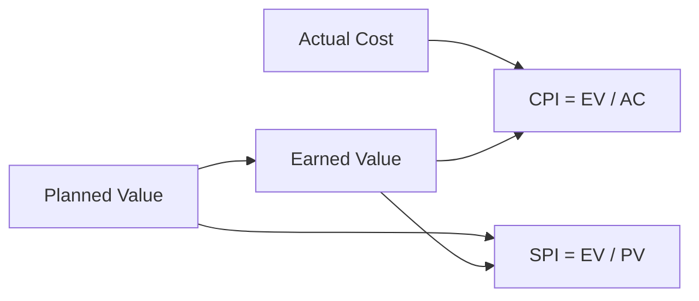

# Class Demo: Cross-Discipline Study Notes

> Writing conventions: ⭐ = exam-level core takeaway; ==highlight== = must-remember term; gray text = supplementary nuance; blockquotes preserve source wording; quizzes are clickable in HTML. Each section receives an automatic self-assessment widget, and saved questions can be copied as AI prompts.

## 1. Quantitative Reasoning 🔥🔥🔥

### 0. Intuition

A metric is useful only when it answers a decision question. The simplest case is a project with planned value, earned value, and actual cost: compare what should have happened, what actually got done, and what it cost. The common misconception is to treat "ahead of schedule" and "under budget" as the same diagnosis.

### 1.1 Earned value diagnosis

⭐ ==CPI== diagnoses cost efficiency; ==SPI== diagnoses schedule efficiency.

> Source wording:
> CPI greater than 1.0 indicates that earned value exceeds actual cost.

Use the formulas $CPI = EV / AC$ and $SPI = EV / PV$. If `EV = 80`, `AC = 100`, and `PV = 90`, then `CPI = 0.80` and `SPI = 0.89`, so the project is both over budget and behind schedule.



```quiz
Q: A project has EV = 80, AC = 100, and PV = 90. Which diagnosis is most accurate?
A: Under budget and ahead of schedule
B: Over budget and behind schedule
C: Under budget but behind schedule
D: Over budget but ahead of schedule
correct: B
explain: CPI = 80/100 = 0.80, so the project is over budget. SPI = 80/90 = 0.89, so the project is behind schedule. The distractors mix up cost and schedule signals.
```

```python
ev, ac, pv = 80, 100, 90
cpi = ev / ac
spi = ev / pv
print({"CPI": round(cpi, 2), "SPI": round(spi, 2)})
```

## 2. Conceptual Analysis 🔥🔥

### 0. Intuition

A concept becomes examinable when it can be mistaken for a neighboring concept. Reliability and validity often travel together, but they answer different questions. Reliability asks whether the instrument is consistent; validity asks whether it measures the intended construct.

### 2.1 Reliability vs validity

⭐ ==Reliability== is consistency; ==validity== is correctness relative to the intended construct.

> Source wording:
> A measure can be reliable without being valid.

A bathroom scale that is always five pounds too high is reliable because repeated readings agree. It is not valid for true weight because the target construct is shifted.

```quiz
Q: Which example best shows a reliable but invalid measure?
A: A survey question that gives random answers each time
B: A thermometer that changes with room temperature
C: A scale that is consistently five pounds too high
D: A rubric that measures the assigned learning objective
correct: C
explain: The scale is consistent, so it is reliable, but it misses the true value, so it is invalid. Option A is unreliable; option D is valid by design.
```

## 3. Argument and Case Work 🔥🔥

### 0. Intuition

Case questions usually reward a repeatable pattern: claim, evidence, warrant, and limitation. The easiest trap is to list facts without tying each fact to the decision or interpretation.

### 3.1 Claim-evidence-warrant template

⭐ A strong case answer connects ==claim -> evidence -> warrant -> limitation== in that order.

> Source wording:
> Evidence does not speak for itself; the writer must explain its relevance.

Worked example:

| Move | Filled example |
|---|---|
| Claim | The city's pilot program improved access but not equity. |
| Evidence | Overall clinic visits rose 18%, while low-income district visits rose only 2%. |
| Warrant | The aggregate gain hides uneven distribution across neighborhoods. |
| Limitation | The data covers one quarter, so seasonal effects remain uncertain. |

```quiz
Q: In a case response, what is the warrant responsible for?
A: Restating the source quotation exactly
B: Explaining why the evidence supports the claim
C: Listing every fact from the case appendix
D: Adding a new claim unrelated to the prompt
correct: B
explain: The warrant is the reasoning bridge between evidence and claim. The other choices either repeat information or break the argument chain.
```

<!-- cheatsheet:start -->
## 📋 Cheatsheet (Demo)

**Quantitative diagnosis template**

| Given | Compute | Decision |
|---|---|---|
| `EV = 80`, `AC = 100`, `PV = 90` | `CPI = EV / AC = 0.80`; `SPI = EV / PV = 0.89` | Cost owner reviews overruns; schedule owner checks delayed work packages. |

Procedure: (1) compute the metric; (2) compare against the neutral threshold; (3) name the decision owner and next action.

**Concept comparison template**

| Pair | Test question | Worked distinction |
|---|---|---|
| Reliability vs validity | Is it consistent, or is it correct? | A scale can repeat the same wrong value: reliable but invalid. |

**Case answer template**

| Step | What to write |
|---|---|
| Claim | One sentence answering the prompt. |
| Evidence | One concrete fact, number, or quote. |
| Warrant | Why that fact proves the claim. |
| Limitation | The boundary condition or uncertainty. |
<!-- cheatsheet:end -->
